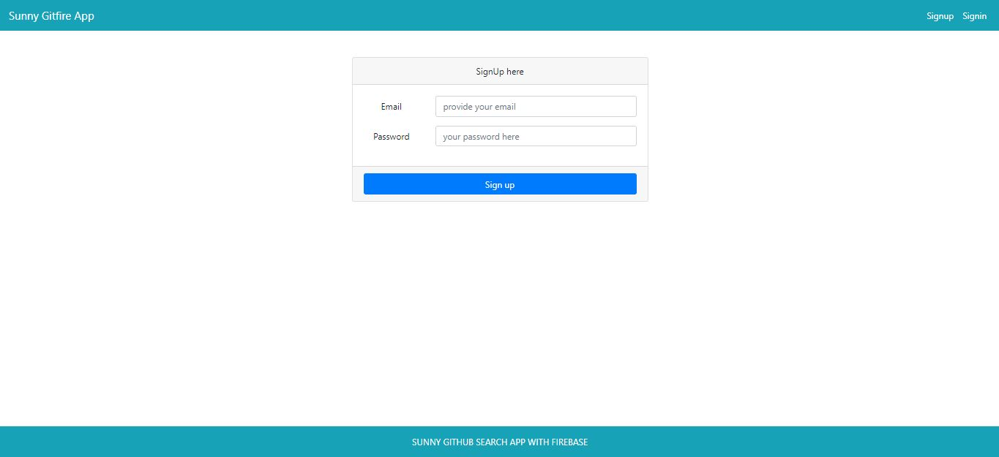
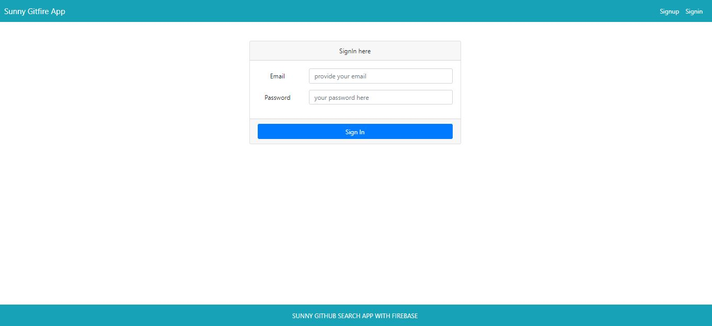
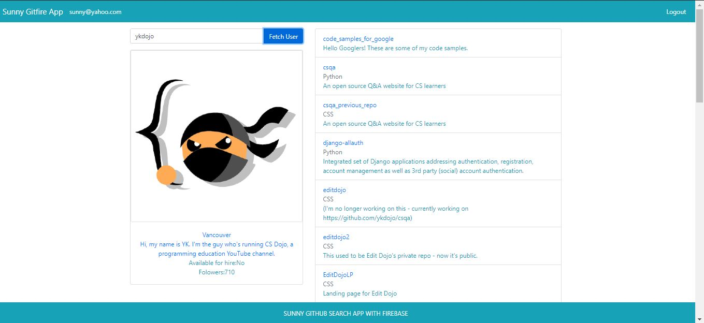

## Gitfire
This web app allows users to sign up/sign in the page, and allows users to search for  profile of any users. This is done with the help of Github API.

### Front End

* React
* Javascript
* HTML

### Back End
* Firebase

## Firebase Configuration

Create a project in firebase and copy all the configs in config/firebaseConfig.js. This will help users to signup/singin the page. 

## Available Scripts

In the project directory, you can run:

### `npm install`

Installs all the dependencies in the package.json along with node_modules which is necessary to run the project.

### `npm start`

Runs the app in the development mode. 
Open [http://localhost:3000](http://localhost:3000) to view it in the browser.

The page will reload if you make edits. 
You will also see any lint errors in the console.

### Screenshots

